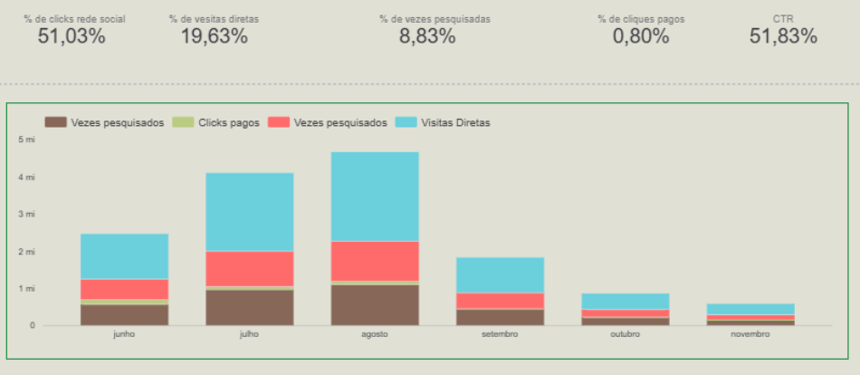

# 📈 Marketing Analytics: Performance de Conteúdo & Tráfego

Este projeto apresenta um ecossistema de monitoramento de performance digital desenvolvido no **Looker Studio**, consolidando métricas de engajamento de artigos, vídeos e campanhas pagas.

## 🎯 Objetivo
Analisar o comportamento dos usuários em diferentes canais para otimizar a retenção (Tempo de Leitura) e a aquisição (Cliques em Redes Sociais vs. Pesquisas).

## 📊 Inteligência de Dados (Cálculos no Looker)
Toda a lógica de métricas foi implementada diretamente no **Looker Studio**, utilizando campos calculados para garantir dinamismo total:
- **CTR (Click-Through Rate):** Medindo a eficiência dos anúncios (Atualmente em **51,83%**).
- **Distribuição de Tráfego:** Monitoramento de fontes (Redes Sociais: **51,03%** | Visitas Diretas: **19,63%**).
- **Engajamento por Categoria:** Tempo de leitura total liderado pelo setor de **Tecnologia** (> 9 mil min).

## 🛠️ Engenharia de Preparação
- **Saneamento (Python):** O script `data_prep.py` realiza a padronização de categorias (ex: 'UX' vs 'ux') e limpeza de strings para evitar fragmentação nos filtros do dashboard.
- **Fontes de Dados:** Estrutura preparada para integração via Google Sheets (Abas: Artigos, Propagandas, Vídeos, Emails).

## 📈 Insights Extraídos
- Identificação de picos de **Novos Usuários Únicos** em períodos sazonais (Julho/Agosto).
- Ranking dos artigos mais lidos, com destaque para "Escuta ativa e como isso mudará sua abordagem" (**2.6M+ visualizações**).
- Correlação entre cliques pagos (**0,80%**) e o volume de tráfego orgânico.
---
## 📸 Preview

---
*Desenvolvido por André - Engenheiro de Dados | Foco em BI & Analytics
